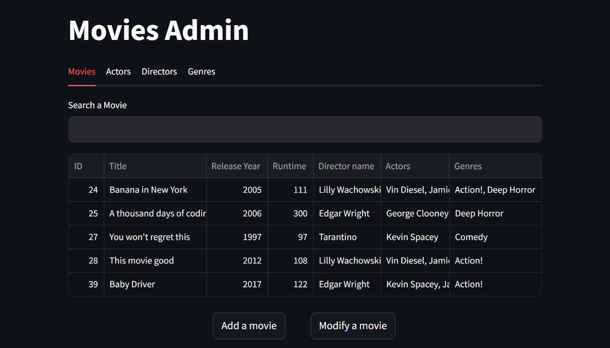
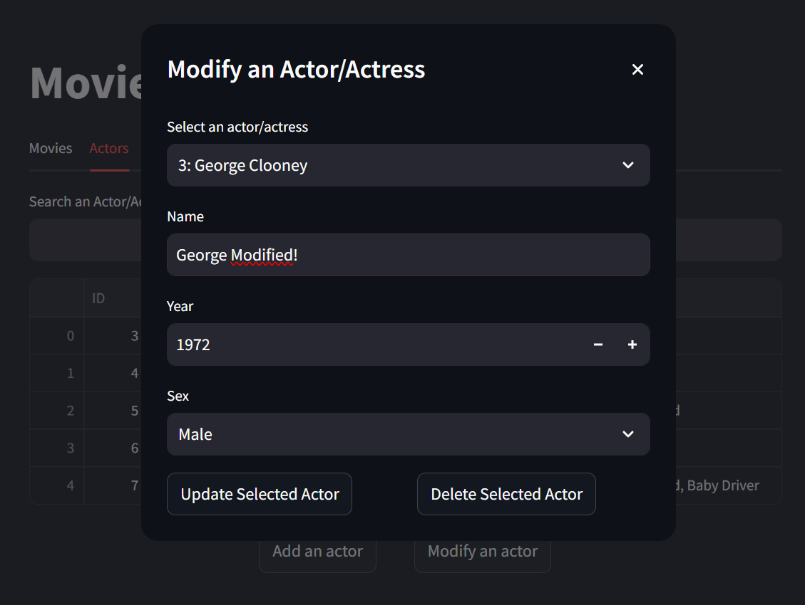
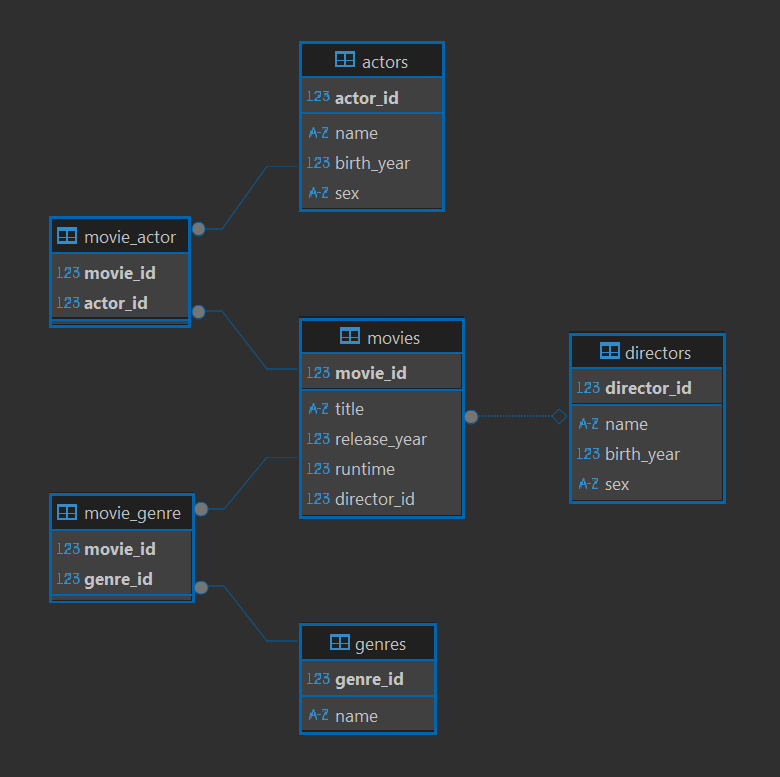

# Movies Admin with StreamLit

This app is meant to be a simple and interactive way to register movies, directors, actors and genres and display all that data
with or without filtering.

To create the app, you can use the docker-compose to create a container with the main app and another container with a MySQL
database.

If you install locally, just use Python 3.13 and run the app with: ``streamlit run .\run.py``.

*Remember to fill the .env file*.

### Interface

#### Developed using MySQL, Streamlit and SQLAlchemy.

